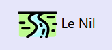
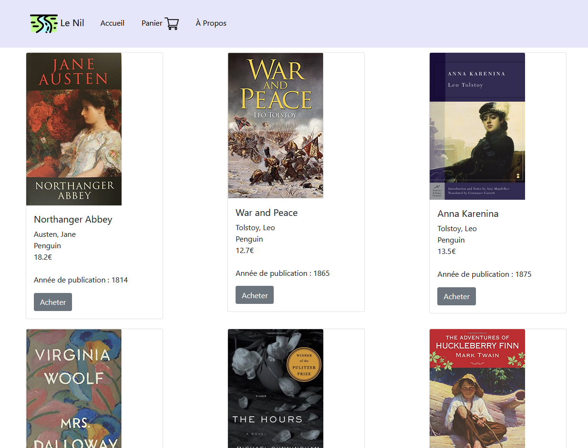
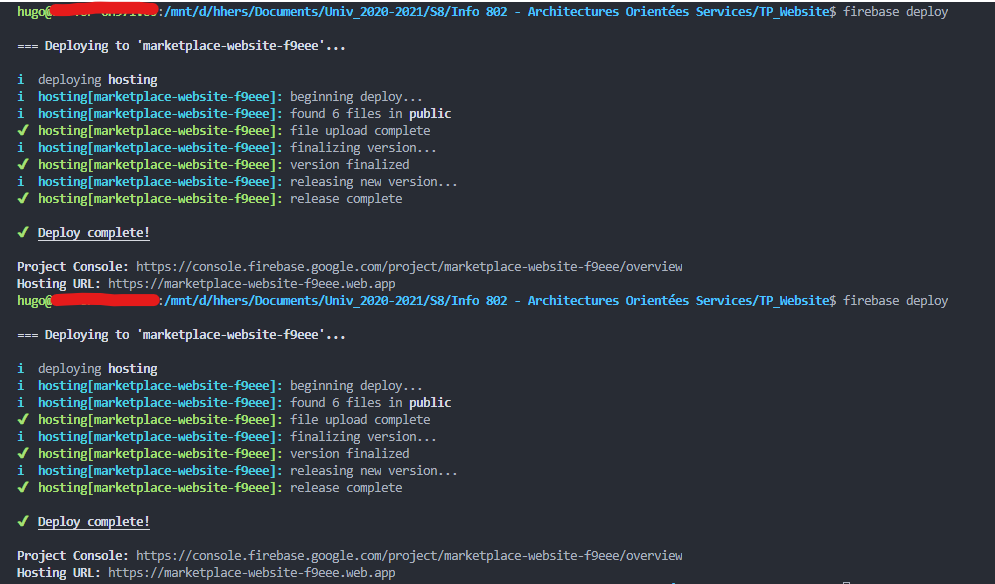
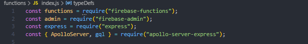
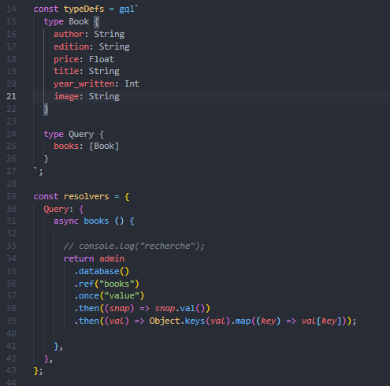
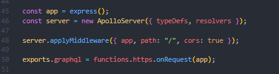
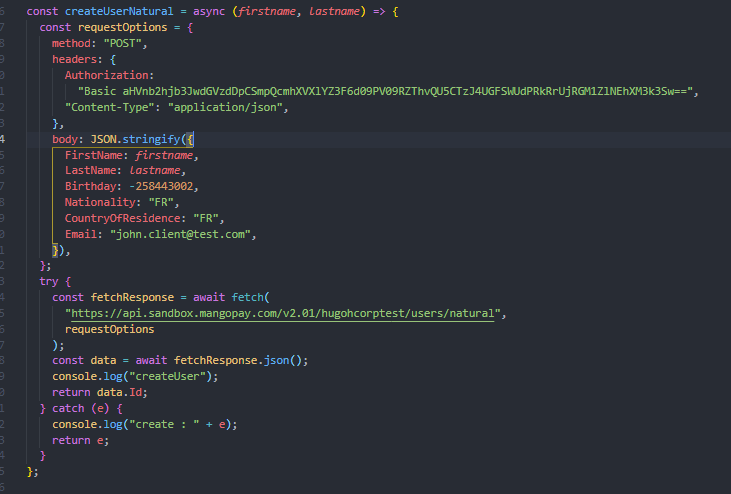
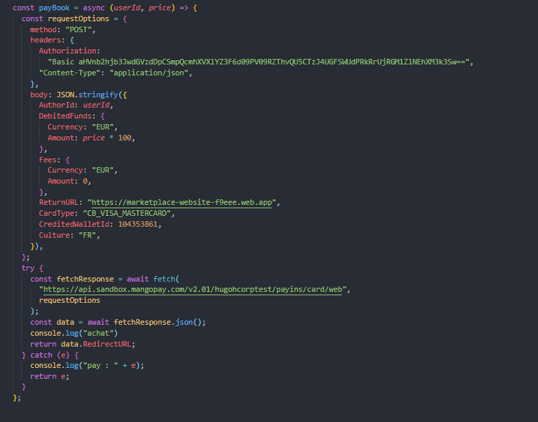
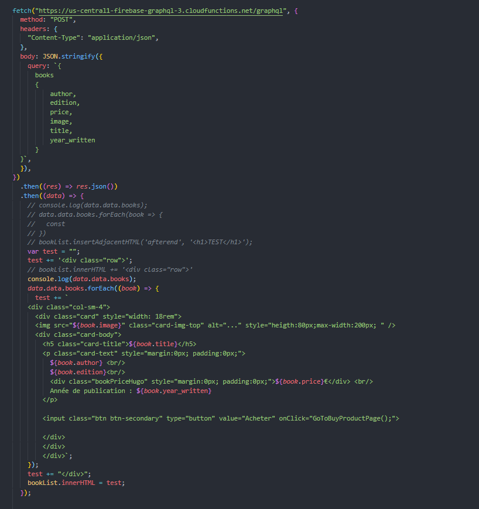

## Fausse librairie en ligne réalisée pour le TP d'Architectures Orientées Services de M. Telisson.

Ce TP est divisé en plusieurs morceaux :
- Une API en graphQL écrite en Node JS et étant hébergée sur Firebase.
Celle-ci permet de récupérer dans la base de données la liste des livres. Base de données étant elle aussi sur firebase.
(Dossier TP_Firebase_GraphQL-3)

- Utilisation d'une API Rest communiquant avec MangoPay, ce qui permet la gestion des paiements, directement codée en js.
(Dans le fichier index.js de TP_Website)

- Site web HTML/CSS/JS avec utilisation de Bootstrap 5 pour l'aspect visuel.
Le site est lui aussi héberger sur Firebase.
(Dossier TP_Website)

Lien du site :
https://marketplace-website-f9eee.web.app/

>Le nil est le fleuve le plus long du monde, donc encore plus long que le fleuve dont le nom a été emprunté dans la création d'une célèbre librairie en ligne ...

---

---

### Hébergement du site :

Avec le Firebase CLI, il est simple d'héberger un site web gratuitement en quelques commandes.

### API GraphQL :

Cette API permet simplement de peupler la liste des livres que l'on voit en page d'accueil, cela assure une bonne communication entre le client et la base de données Firebase.

On utilise Node JS et les packages 'express', 'apollo-server-express' ainsi que 'graphql' et les 'firebase tools'.

Une fois que, dans le code, on s'identifie à notre projet Firebase correspondant précédemment créé, on peut réaliser nos schémas de types et nos resolvers : 

On crée ensuite un serveur express et on l'exporte vers Firebase.

### Rest et MangoPay

On utilise MangoPay pour gérer les paiements.

Dans notre cas, l'acheteur est toujours le même, néanmoins, pour ne pas avoir à faire un système de login et de mot de passe propre à notre site, on va créer un 'Natural User' à chaque achat avec ces informations personnelles telles que son nom et prénom, date de naissance ou encore nationalité.

On va pouvoir ensuite effectuer le paiement de cet utilisateur vers le porte feuille du trésorier, dont on a enregistré le porte feuille justement.
Il y aura alors beaucoup d'informations à rentrer, telle que l'id du porte feuille destinataire, l'id de l'expéditeur, le montant, l'URL sur lequel le client sera envoyé pour procéder au paiement par carte, etc ...

### Le site Web

Il s'agit d'un site en HTML/CSS/JS utilisant aussi Bootstrap 5 pour son aspect visuel. Cela m'a permit de facilement obtenir des cartes standardisées pour chaque livre de la boutique. Ces cartes s'adaptent aussi très bien aux modifications de la taille de l'écran.

D'ailleurs, voici la requête permettant de récupérer les livres dans la base de donnée. Pour chaque livre, on créé ensuite une carte avec son image et ses informations, avec la syntaxe particulière à Bootstrap. (dans index.js de TP_Website)

